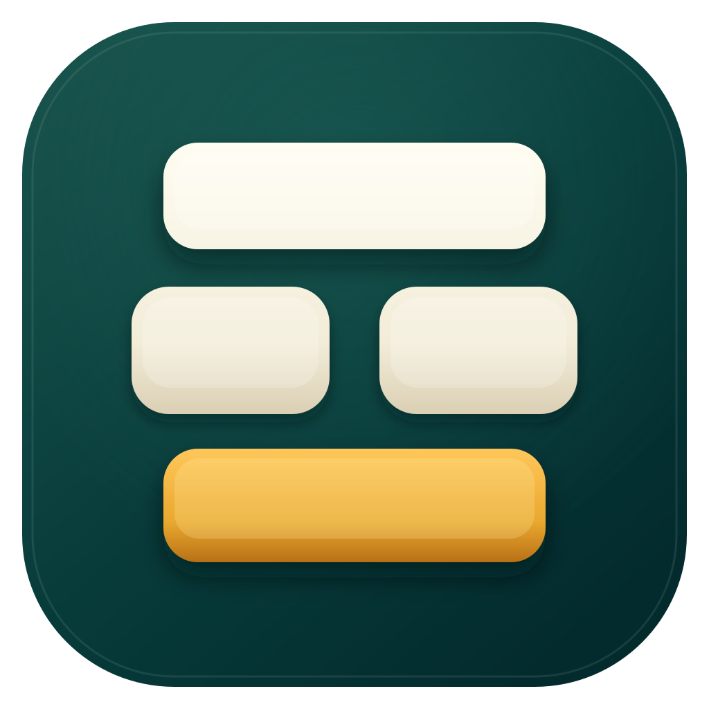

<p align="center">
  
</p>

<h1 align="center">Mac Wubi 86</h1>

<p align="center">
  一款真正属于 Mac 的五笔 86 输入法。<br>
  <strong>快、轻、安静——所有输入都留在本机。</strong>
</p>

<p align="center">
  <a href="https://github.com/agol586/wb86/releases/tag/v1.5.2"></a>
  
  
  
  
</p>

<p align="center">
  <a href="https://agol586.github.io/wb86/"><strong>官方网站</strong></a>
  ·
  <a href="https://github.com/agol586/wb86/releases/tag/v1.5.2"><strong>获取 v1.5.2</strong></a>
  ·
  <a href="Docs/UserGuide.md">用户指南</a>
  ·
  <a href="Docs/SigningAndDistribution.md">签名与分发</a>
  ·
  <a href="Docs/LexiconProvenance.md">词库来源</a>
</p>

---

Mac Wubi 86 是为 Apple Silicon Mac 从头构建的原生五笔输入法。它没有账户、云同步、遥测、
广告或在线候选；核心引擎使用纯 Swift，输入、学习和个人词库始终在本机处理。

## 为什么是 Mac Wubi 86？

| | |
|---|---|
| **原生且迅速** | Swift + InputMethodKit，候选查询发布门禁 `< 2 ms`，不依赖 Rosetta 或重型运行时。 |
| **五笔优先，拼音兜底** | 熟悉的五笔 86 工作流不变；忘记编码时可直接输入全拼，`shenm` 已能预测“什么”。 |
| **真正离线** | 零网络能力、零输入正文日志；设置、词库和学习数据只保存在本机。 |
| **懂得你的习惯** | 本地候选学习、自定义词库、简繁切换、全半角、标点和完整快捷键配置。 |
| **不怕升级出错** | 分域版本化快照、原子迁移、损坏隔离和可恢复的上一版本。 |
| **为 macOS 而生** | 深浅色候选、多显示器定位、鼠标选择、键盘全流程操作和系统输入菜单集成。 |

## 输入，应该这么自然

| 输入 | 体验 |
|---|---|
| `wqvb` | 五笔词组直接候选“你好” |
| `sm` | 在“机”之后继续联想“机会、机构、机场、机器……” |
| `shenm` | 拼音尚未输完，提前候选“什么” |
| `shenme` | 完整拼音继续优先返回精确候选 |

空格提交首选，数字键或鼠标选词，Escape 取消，Backspace 修码。翻页键、Shift 中英文切换、
简繁、全半角、中文标点、自动上屏和候选数量都可以配置。拼音混输可随时关闭，恢复纯五笔体验；
扩展汉字默认隐藏，也可在“常用”设置中完整显示。
组合中按 Shift 会先把当前原始编码上屏再切换；中文状态以大写字母开头时，本段原文会在 marked
text 和候选框中同步显示且不改变中英文状态，空格或回车后整段上屏并恢复五笔处理；结束用的
空格或回车本身不会附加到文字。

## 功能一览

- 标准五笔 86 一至四码、简码、全码、单字、词组及稳定重码候选。
- 五笔优先、全拼随后，支持拼音前缀预测、候选去重和当前简繁模式。
- 本地有界学习、用户词库搜索/编辑、UTF-8 与产品归档格式导入导出。
- 中英文、简繁、全半角、标点、扩展汉字、四码唯一及五码首选等独立选项。
- 每页 5–9 个候选、横向/纵向布局、字号缩放、深浅色和高对比度。横排页码常驻同排末尾，
  仅显示 `1/10` 这样的格式，单页显示 `1/1`，预留页码空间避免分页状态改变时窗口跳动。
- 私密模式、关闭学习、分域删除、保留数据卸载及显式彻底清理。
- 系统级安装、原子升级、回滚、严格签名检查与完整隐私审计脚本。

## 快速开始

需要 Apple Silicon Mac、macOS 13 或更高版本以及 Xcode。v1.5.2 以源码 Release 发布；正式 Developer
ID 公证安装包仍需完成最终硬件矩阵与公证门禁。

```bash
git clone git@github.com:agol586/wb86.git
cd wb86

# 构建并验证原生 arm64 Release
Scripts/build-release.sh
Scripts/verify-release.sh "$PWD/.build/xcode/Build/Products/Release/MacWubi.app"
```

如需安装到系统输入源，请使用 Apple Development 或 Developer ID 身份重新签名，再执行：

```bash
MACWUBI_CODE_SIGN_IDENTITY="Apple Development: Name (TEAMID)" Scripts/build-release.sh
Scripts/install.sh "$PWD/.build/xcode/Build/Products/Release/MacWubi.app"
```

之后打开“系统设置 → 键盘 → 文本输入 → 编辑”，在中文输入源中添加 **Mac Wubi 86**。
完整安装、启用、设置、迁移、卸载和故障排查见[用户指南](Docs/UserGuide.md)。不要为加载输入法
关闭 Gatekeeper 或 SIP。

## 架构

```text
macOS 文本应用
       │
       ▼
InputMethodKit 适配层 ── 每个输入会话独立状态、候选窗口、设置界面
       │
       ▼
纯 Swift 核心引擎 ───── 状态机、词库查询、排序、输入模式
       │
       ├── 签名只读基础词库
       ▼
本地版本化快照 ───────── Settings / UserLexicon / Learning
```

`Sources/Core/` 不导入 AppKit 或 InputMethodKit。可变数据仅写入
`~/Library/Application Support/org.macwubi.inputmethod/`，目录权限为 `0700`、文件权限为
`0600`。外部文件只在用户主动导入或导出时访问。

## 开发与验证

```bash
Scripts/test.sh
Scripts/build-release.sh
Scripts/verify-release.sh /绝对路径/MacWubi.app
Scripts/privacy-audit.sh /绝对路径/MacWubi.app
Scripts/run-long-stress.sh /绝对路径/MacWubi.app 1000000
```

项目要求发布候选为精确 `arm64`、Hardened Runtime、无网络 entitlement、无第三方动态库；
正常输入 physical footprint `< 15 MiB`，所有基准样本首批候选 `< 2 ms`。详细工程约束见
[AGENTS.md](AGENTS.md)和[项目宪章](.specify/memory/constitution.md)。

## 支持边界与诚实状态

- **仅支持：** Apple Silicon、macOS 13+、五笔 86、全拼混输、普通键盘和鼠标操作。
- **暂不支持：** Intel Mac、Rosetta、五笔 98/新世纪、双拼、模糊音、在线候选和云同步。
- **辅助技术边界：** VoiceOver、Accessibility Inspector 及屏幕阅读器专用朗读/焦点不在支持范围。
- **仍待完成：** macOS 13 与当前系统的最终实机发布矩阵、首次用户研究、30 天替代研究、
  Developer ID 公证与 Gatekeeper 最终证据。

基础五笔词库来自固定提交的 `rime/rime-wubi`，全拼词库来自固定提交的
`rime/rime-pinyin-simp`；来源、许可、校验和及可复现编译信息见
[Docs/LexiconProvenance.md](Docs/LexiconProvenance.md)。项目 Swift 源代码许可证尚未确定，
第三方词库与简繁转换数据继续遵循各自许可证。

---

<p align="center">
  <strong>让五笔留在手上，让隐私留在 Mac 里。</strong>
</p>
